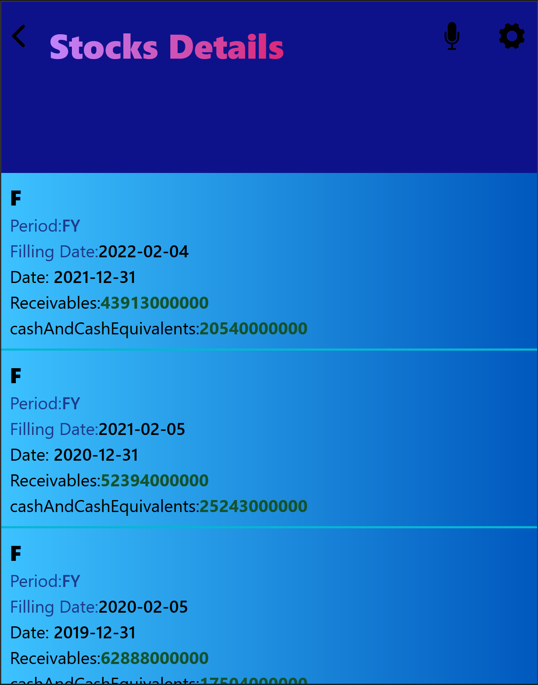

# Stock Data

> This is a web app built with the financial api data that fetches the different companies listed at the major stock exchanges in USA, like NASDAQ and NYSE. The app fetches data from two different APIs , combines them and then outputs the data to the screen.

##  Video Documentation

[Video](./src/images/video1616425580.mp4)
## Live Version
[Live Version](https://62050a196ea7b6135a63b494--adoring-goldberg-acd131.netlify.app/)
## Screenshots




## Built With

- HTML
- CSS
- JavaScript
- REACT
- Redux
- Webpack
- Jest
- tailwindcss

## Getting Started

To run a local copy, follow these steps

### Prerequisites
- A text editor
- Install Node
- Web browser
## Use Locally

- Clone the repo here

```bash 
git clone https://github.com/DelhinRharl/stock-data

cd covid19-metrics
```

- Installing node dependencies

```bash
npm install
```
-  To launch in the browser
```bash
npm start
```
- Testing the project
```bash
npm run test
```
## Authors

👤 **Affaxed Kiprotich**

- GitHub: [@githubhandle](https://github.com/DelhinRharl)
- Twitter: [@twitterhandle](https://twitter.com/delhinrharl)
- LinkedIn: [LinkedIn](https://linkedin.com/in/affaxed-kiprotich)


## 🤝 Contributing

Contributions, issues, and feature requests are welcome!

Feel free to check the [issues page](https://github.com/DelhinRharl/stock-data/issues).

## Show your support

Give a ⭐️ if you like this project!

## Acknowledgments

- Based on original design for Creative Commons by Nelson Sakwa on [Behance](https://www.behance.net/sakwadesignstudio).
## 📝 License

This project is [MIT](./MIT.md) licensed.
